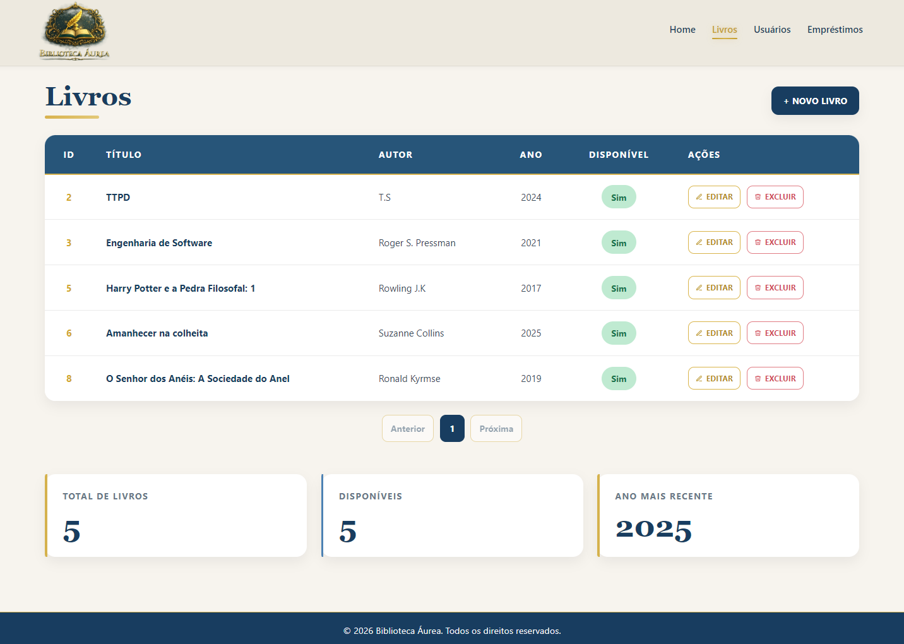
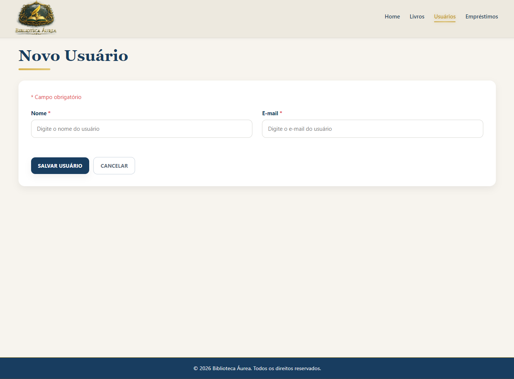
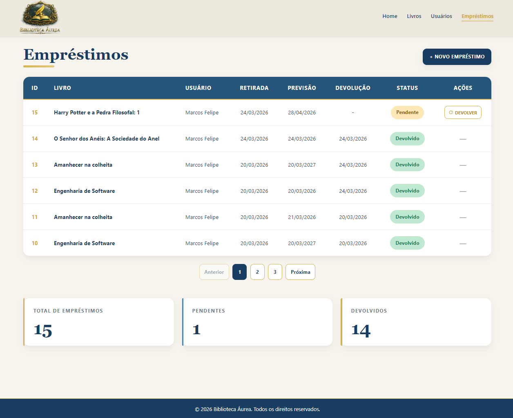

# 📚 Biblioteca Áurea

Sistema de gerenciamento de biblioteca desenvolvido em **C# com ASP.NET Core MVC**, com foco em **boas práticas de arquitetura, organização de código e regras de negócio bem definidas**.

---

## 🎯 Objetivo do projeto

Este projeto foi desenvolvido com o objetivo de praticar:

- Arquitetura em camadas
- Separação de responsabilidades
- Modelagem de domínio
- Boas práticas com ASP.NET Core e Entity Framework
- Escrita de código limpo e testável

---

## 🚀 Funcionalidades

- Cadastro, edição e exclusão de livros
- Cadastro, edição e exclusão de usuários
- Registro de empréstimos e devoluções
- Controle de disponibilidade de livros
- Paginação nas listagens
- Validações de regras de negócio
- Testes automatizados

---

## ✅ Qualidade e testes

- Testes unitários de regras de negócio com xUnit
- Testes de integração para fluxo de empréstimo (AppService + DbContext)
- Pipeline CI com GitHub Actions executando build e testes a cada push/PR

---

## 🛠️ Tecnologias utilizadas

- .NET 8
- ASP.NET Core MVC
- Entity Framework Core
- SQLite
- xUnit

---

## 🏗️ Arquitetura do projeto

O sistema foi estruturado utilizando separação em camadas:

```text
Controller → Service (Application Layer) → DbContext → Banco de Dados
```

### Camadas:

- **Biblioteca (Core)**
  Contém regras de negócio, entidades e serviços do domínio

- **Biblioteca.Web**
  Responsável pela interface MVC e interação com o usuário

- **Services (Application Layer)**
  Centraliza a lógica de aplicação, evitando acoplamento com controllers

- **Biblioteca.Tests**
  Testes automatizados das entidades e regras principais

---

### Decisões de arquitetura

- **Domínio rico**: regras de negócio ficam nas entidades (`Livro`, `Usuario`, `Emprestimo`), evitando lógica espalhada em controllers.
- **Application Service**: `EmprestimoAppService` orquestra casos de uso da aplicação web.
- **Persistência com EF Core + SQLite**: simplicidade local com estrutura pronta para evoluir para SQL Server/PostgreSQL.
- **Separação de projetos**:
  - `Biblioteca` → domínio
  - `Biblioteca.Web` → interface MVC + dados
  - `Biblioteca.Tests` → testes automatizados
  - `Biblioteca.Console` → simulação em terminal

  ***

## 🧠 Regras de negócio

- Livro emprestado fica indisponível
- Não é possível emprestar livro indisponível
- Não é possível excluir usuário com histórico de empréstimos
- Não é possível excluir livro com histórico de empréstimos
- A data prevista de devolução:
  - Não pode ser no passado
  - Não pode ultrapassar **365 dias**

---

## 🔍 Diferenciais técnicos

- Uso de **injeção de dependência**
- Aplicação de **separação de responsabilidades (SoC)**
- Implementação de **camada de serviço (Application Layer)**
- Código organizado seguindo boas práticas de **Clean Code**
- Estrutura preparada para evolução (API, testes, etc.)

---

## ▶️ Como executar o projeto

### 1. Restaurar dependências

```bash
dotnet restore
```

### 2. Compilar o projeto

```bash
dotnet build
```

### 3. Executar a aplicação web

```bash
dotnet run --project Biblioteca.Web/Biblioteca.Web.csproj
```

### 4. Executar os testes

```bash
dotnet test
```

## 📸 Interface do sistema

### 🏠 Página inicial


### 📚 Listagem de livros



### ➕ Cadastro de livro



### 🔄 Empréstimos



---

## 📚 Aprendizados

Este projeto me permitiu praticar:

- modelagem de domínio e encapsulamento de regras
- tratamento de exceções e validações de entrada
- uso de Entity Framework Core com migrations
- escrita de testes e automação com CI
- organização de solução em camadas

---

## 👨‍💻 Autor

**Felipe França**
